# Biome thumbnails for EMI

Every modded biome EMI lists, its sprite as it stands today, and a slot for an in-game screenshot to redraw it from.

`emi_ores` adds all biomes to the EMI index and looks for a 16x16 sprite at `assets/<namespace>/textures/biome/<name>.png`. With none present it falls back to `emi_ores:biome/missing`, the checkerboard below.

Sprites are shown at 4x. Reference screenshots are shown at 240px; the full-resolution originals are kept locally in `biome-sprites/screenshots/<mod>/<biome>.png` and are deliberately not tracked in git.

**152 of 212 modded biomes have a sprite; 60 still fall back to `missing.png`.**

| Mod | Biomes | With sprite | Missing |
|---|---:|---:|---:|
| Biomes O' Plenty | 69 | 69 | 0 |
| Regions Unexplored | 78 | 78 | 0 |
| Oh The Biomes We've Gone | 55 | 5 | 50 |
| Spawn | 10 | 0 | 10 |

## Biomes O' Plenty — `biomesoplenty`

69 of 69 have a sprite.

| Biome | Current sprite | Screenshot |
|---|---|---|
| `biomesoplenty:aspen_glade` |  | 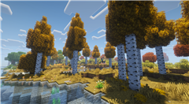 |
| `biomesoplenty:auroral_garden` |  | 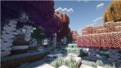 |
| `biomesoplenty:bayou` | 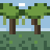 | 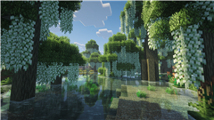 |
| `biomesoplenty:bog` | 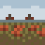 | 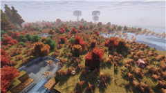 |
| `biomesoplenty:cold_desert` | 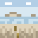 | 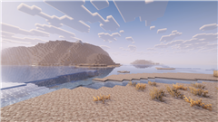 |
| `biomesoplenty:coniferous_forest` |  | 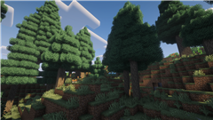 |
| `biomesoplenty:crag` | 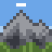 | 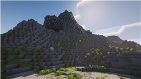 |
| `biomesoplenty:crystalline_chasm` | 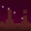 |  |
| `biomesoplenty:dead_forest` |  | 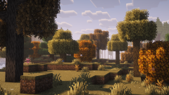 |
| `biomesoplenty:dryland` |  |  |
| `biomesoplenty:dune_beach` | 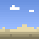 |  |
| `biomesoplenty:end_corruption` |  |  |
| `biomesoplenty:end_reef` | 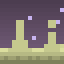 |  |
| `biomesoplenty:end_wilds` |  |  |
| `biomesoplenty:erupting_inferno` | 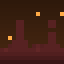 |  |
| `biomesoplenty:field` |  |  |
| `biomesoplenty:fir_clearing` |  |  |
| `biomesoplenty:floodplain` |  |  |
| `biomesoplenty:forested_field` |  |  |
| `biomesoplenty:fungal_jungle` |  |  |
| `biomesoplenty:glowing_grotto` | 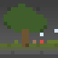 |  |
| `biomesoplenty:grassland` | 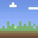 |  |
| `biomesoplenty:gravel_beach` |  |  |
| `biomesoplenty:highland` |  |  |
| `biomesoplenty:hot_springs` |  |  |
| `biomesoplenty:jacaranda_glade` |  |  |
| `biomesoplenty:jade_cliffs` | 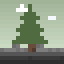 |  |
| `biomesoplenty:lavender_field` |  |  |
| `biomesoplenty:lush_desert` | 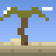 |  |
| `biomesoplenty:lush_savanna` |  |  |
| `biomesoplenty:maple_woods` | 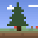 |  |
| `biomesoplenty:marsh` | 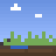 |  |
| `biomesoplenty:mediterranean_forest` |  |  |
| `biomesoplenty:moor` | 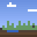 |  |
| `biomesoplenty:muskeg` |  |  |
| `biomesoplenty:mystic_grove` |  |  |
| `biomesoplenty:old_growth_dead_forest` |  |  |
| `biomesoplenty:old_growth_woodland` |  |  |
| `biomesoplenty:ominous_woods` | 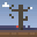 |  |
| `biomesoplenty:orchard` |  |  |
| `biomesoplenty:origin_valley` |  |  |
| `biomesoplenty:overgrown_greens` | 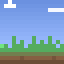 |  |
| `biomesoplenty:pasture` | 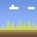 |  |
| `biomesoplenty:prairie` | 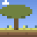 |  |
| `biomesoplenty:pumpkin_patch` |  |  |
| `biomesoplenty:rainforest` |  |  |
| `biomesoplenty:redwood_forest` | 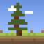 |  |
| `biomesoplenty:rocky_rainforest` |  |  |
| `biomesoplenty:rocky_shrubland` |  |  |
| `biomesoplenty:scrubland` |  |  |
| `biomesoplenty:seasonal_forest` |  |  |
| `biomesoplenty:shrubland` |  |  |
| `biomesoplenty:snowblossom_grove` |  |  |
| `biomesoplenty:snowy_coniferous_forest` |  |  |
| `biomesoplenty:snowy_fir_clearing` |  |  |
| `biomesoplenty:snowy_maple_woods` |  |  |
| `biomesoplenty:spider_nest` | 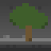 |  |
| `biomesoplenty:tropics` | 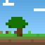 |  |
| `biomesoplenty:tundra` |  |  |
| `biomesoplenty:undergrowth` | 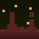 |  |
| `biomesoplenty:visceral_heap` | 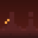 |  |
| `biomesoplenty:volcanic_plains` |  |  |
| `biomesoplenty:volcano` |  |  |
| `biomesoplenty:wasteland` |  |  |
| `biomesoplenty:wasteland_steppe` |  |  |
| `biomesoplenty:wetland` | 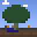 |  |
| `biomesoplenty:wintry_origin_valley` |  |  |
| `biomesoplenty:withered_abyss` | 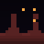 |  |
| `biomesoplenty:woodland` |  |  |

## Regions Unexplored — `regions_unexplored`

78 of 78 have a sprite.

| Biome | Current sprite | Screenshot |
|---|---|---|
| `regions_unexplored:alpha_grove` |  |  |
| `regions_unexplored:ancient_delta` | 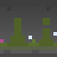 |  |
| `regions_unexplored:arid_mountains` |  |  |
| `regions_unexplored:ashen_woodland` |  |  |
| `regions_unexplored:autumnal_maple_forest` |  |  |
| `regions_unexplored:bamboo_forest` | 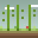 |  |
| `regions_unexplored:baobab_savanna` |  |  |
| `regions_unexplored:barley_fields` | 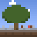 |  |
| `regions_unexplored:bayou` | 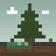 |  |
| `regions_unexplored:bioshroom_caves` |  |  |
| `regions_unexplored:blackstone_basin` |  |  |
| `regions_unexplored:blackwood_taiga` | 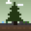 |  |
| `regions_unexplored:boreal_taiga` | 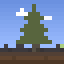 |  |
| `regions_unexplored:chalk_cliffs` | 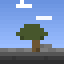 |  |
| `regions_unexplored:clover_plains` | 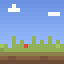 |  |
| `regions_unexplored:cold_boreal_taiga` |  |  |
| `regions_unexplored:cold_deciduous_forest` |  |  |
| `regions_unexplored:cold_river` |  |  |
| `regions_unexplored:deciduous_forest` |  |  |
| `regions_unexplored:dry_bushland` | 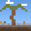 |  |
| `regions_unexplored:eucalyptus_forest` |  |  |
| `regions_unexplored:fen` | 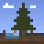 |  |
| `regions_unexplored:flower_fields` |  |  |
| `regions_unexplored:frozen_pine_taiga` | 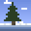 |  |
| `regions_unexplored:frozen_tundra` |  |  |
| `regions_unexplored:fungal_fen` | 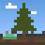 |  |
| `regions_unexplored:glistering_meadow` | 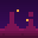 |  |
| `regions_unexplored:golden_boreal_taiga` | 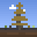 |  |
| `regions_unexplored:grassland` | 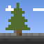 |  |
| `regions_unexplored:grassy_beach` |  |  |
| `regions_unexplored:gravel_beach` |  |  |
| `regions_unexplored:highland_fields` | 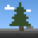 |  |
| `regions_unexplored:hyacinth_deeps` |  |  |
| `regions_unexplored:icy_heights` |  |  |
| `regions_unexplored:infernal_holt` |  |  |
| `regions_unexplored:inferno` |  |  |
| `regions_unexplored:joshua_desert` |  |  |
| `regions_unexplored:magnolia_woodland` |  |  |
| `regions_unexplored:maple_forest` |  |  |
| `regions_unexplored:marsh` |  |  |
| `regions_unexplored:mauve_hills` |  |  |
| `regions_unexplored:mountains` |  |  |
| `regions_unexplored:muddy_river` |  |  |
| `regions_unexplored:mycotoxic_undergrowth` |  |  |
| `regions_unexplored:old_growth_bayou` |  |  |
| `regions_unexplored:old_growth_boreal_taiga` |  |  |
| `regions_unexplored:old_growth_forest` |  |  |
| `regions_unexplored:old_growth_golden_boreal_taiga` |  |  |
| `regions_unexplored:orchard` |  |  |
| `regions_unexplored:outback` |  |  |
| `regions_unexplored:pine_slopes` |  |  |
| `regions_unexplored:pine_taiga` |  |  |
| `regions_unexplored:poppy_fields` |  |  |
| `regions_unexplored:prairie` |  |  |
| `regions_unexplored:prismachasm` |  |  |
| `regions_unexplored:pumpkin_fields` |  |  |
| `regions_unexplored:rainforest` |  |  |
| `regions_unexplored:redstone_abyss` |  |  |
| `regions_unexplored:redstone_caves` |  |  |
| `regions_unexplored:redwoods` |  |  |
| `regions_unexplored:rocky_meadow` |  |  |
| `regions_unexplored:rocky_reef` |  |  |
| `regions_unexplored:saguaro_desert` |  |  |
| `regions_unexplored:scorching_caves` |  |  |
| `regions_unexplored:shrubland` |  |  |
| `regions_unexplored:silver_birch_forest` |  |  |
| `regions_unexplored:sparse_rainforest` |  |  |
| `regions_unexplored:sparse_redwoods` |  |  |
| `regions_unexplored:spires` |  |  |
| `regions_unexplored:steppe` |  |  |
| `regions_unexplored:temperate_grove` |  |  |
| `regions_unexplored:towering_cliffs` |  |  |
| `regions_unexplored:tropical_river` |  |  |
| `regions_unexplored:tropics` |  |  |
| `regions_unexplored:tundra` |  |  |
| `regions_unexplored:willow_forest` |  |  |
| `regions_unexplored:windswept_maple_forest` |  |  |
| `regions_unexplored:wisteria_grove` |  |  |

## Oh The Biomes We've Gone — `biomeswevegone`

5 of 55 have a sprite.

| Biome | Current sprite | Screenshot |
|---|---|---|
| `biomeswevegone:allium_shrubland` **(disabled in config — does not generate)** |  |  |
| `biomeswevegone:amaranth_grassland` |  |  |
| `biomeswevegone:araucaria_savanna` |  |  |
| `biomeswevegone:aspen_boreal` |  |  |
| `biomeswevegone:atacama_outback` |  |  |
| `biomeswevegone:baobab_savanna` |  |  |
| `biomeswevegone:basalt_barrera` |  |  |
| `biomeswevegone:bayou` |  |  |
| `biomeswevegone:black_forest` |  |  |
| `biomeswevegone:canadian_shield` |  |  |
| `biomeswevegone:cika_woods` |  |  |
| `biomeswevegone:coconino_meadow` |  |  |
| `biomeswevegone:coniferous_forest` |  |  |
| `biomeswevegone:crag_gardens` |  |  |
| `biomeswevegone:crimson_tundra` |  |  |
| `biomeswevegone:cypress_swamplands` |  |  |
| `biomeswevegone:cypress_wetlands` |  |  |
| `biomeswevegone:dacite_ridges` |  |  |
| `biomeswevegone:dacite_shore` |  |  |
| `biomeswevegone:dead_sea` |  |  |
| `biomeswevegone:ebony_woods` |  |  |
| `biomeswevegone:enchanted_tangle` |  |  |
| `biomeswevegone:eroded_borealis` **(disabled in config — does not generate)** |  |  |
| `biomeswevegone:firecracker_chaparral` |  |  |
| `biomeswevegone:forgotten_forest` |  |  |
| `biomeswevegone:fragment_jungle` |  |  |
| `biomeswevegone:frosted_coniferous_forest` |  |  |
| `biomeswevegone:frosted_taiga` |  |  |
| `biomeswevegone:howling_peaks` |  |  |
| `biomeswevegone:ironwood_gour` |  |  |
| `biomeswevegone:jacaranda_jungle` |  |  |
| `biomeswevegone:lush_stacks` |  |  |
| `biomeswevegone:maple_taiga` |  |  |
| `biomeswevegone:mojave_desert` |  |  |
| `biomeswevegone:orchard` |  |  |
| `biomeswevegone:overgrowth_woodlands` |  |  |
| `biomeswevegone:pale_bog` |  |  |
| `biomeswevegone:prairie` |  |  |
| `biomeswevegone:pumpkin_valley` **(disabled in config — does not generate)** |  |  |
| `biomeswevegone:rainbow_beach` |  |  |
| `biomeswevegone:red_rock_peaks` |  |  |
| `biomeswevegone:red_rock_valley` |  |  |
| `biomeswevegone:redwood_thicket` |  |  |
| `biomeswevegone:rose_fields` |  |  |
| `biomeswevegone:rugged_badlands` |  |  |
| `biomeswevegone:sakura_grove` |  |  |
| `biomeswevegone:shattered_glacier` **(disabled in config — does not generate)** |  |  |
| `biomeswevegone:sierra_badlands` |  |  |
| `biomeswevegone:skyris_vale` |  |  |
| `biomeswevegone:temperate_grove` |  |  |
| `biomeswevegone:tropical_rainforest` |  |  |
| `biomeswevegone:weeping_witch_forest` |  |  |
| `biomeswevegone:white_mangrove_marshes` |  |  |
| `biomeswevegone:windswept_desert` |  |  |
| `biomeswevegone:zelkova_forest` |  |  |

## Spawn — `spawn`

0 of 10 have a sprite.

| Biome | Current sprite | Screenshot |
|---|---|---|
| `spawn:ant_gardens` |  |  |
| `spawn:cold_island` |  |  |
| `spawn:deep_warm_ocean` |  |  |
| `spawn:dodo_island` |  |  |
| `spawn:rocky_shore` |  |  |
| `spawn:sandy_island` |  |  |
| `spawn:seagrass_meadow` |  |  |
| `spawn:tide_pool` |  |  |
| `spawn:tropical_island` |  |  |
| `spawn:volcanic_island` |  |  |
